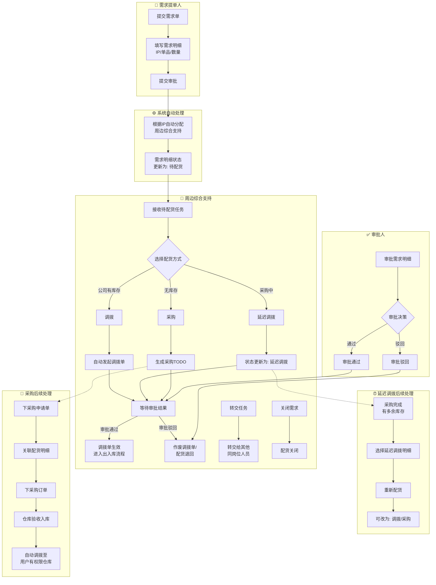

# 周边需求配货系统 - 业务流程图（泳道图）

---

## 业务流程详细说明

### 阶段一：需求提交
| 步骤 | 执行人 | 操作 | 系统处理 |
|-----|-------|------|---------|
| 1 | 需求提单人 | 提交需求单 | - |
| 2 | 需求提单人 | 填写需求明细（IP、单品、数量） | - |
| 3 | 需求提单人 | 提交审批 | 系统自动根据IP分配周边综合支持 |
| 4 | 系统 | - | 需求明细状态更新为「待配货」 |

### 阶段二：配货处理（核心流程）
| 步骤 | 执行人 | 判断条件 | 操作 | 结果 |
|-----|-------|---------|------|------|
| 1 | 周边综合支持 | 公司有库存 | 选择「调拨」 | 自动发起调拨单 |
| 2 | 周边综合支持 | 单品还在采购中 | 选择「延迟调拨」 | 状态更新为「延迟调拨」 |
| 3 | 周边综合支持 | 公司无库存、无在途采购 | 选择「采购」 | 生成采购TODO |

### 阶段三：审批流程
| 步骤 | 执行人 | 决策 | 正向结果 | 逆向结果 |
|-----|-------|------|---------|---------|
| 1 | 审批人 | 通过 | 调拨单生效，进入出入库流程 | - |
| 2 | 审批人 | 驳回 | - | 作废调拨单/配货退回 |

### 阶段四：延迟调拨后续
| 步骤 | 执行人 | 触发条件 | 操作 |
|-----|-------|---------|------|
| 1 | 周边综合支持 | 采购完成且有多余库存 | 选择延迟调拨明细 |
| 2 | 周边综合支持 | - | 重新配货 |
| 3 | 周边综合支持 | - | 可改为「调拨」或「采购」 |

### 阶段五：采购后续
| 步骤 | 执行人 | 操作 | 说明 |
|-----|-------|------|------|
| 1 | 周边PM/综合支持 | 下采购申请单 | 关联配货明细 |
| 2 | 周边PM/综合支持 | 下采购订单 | - |
| 3 | 仓库 | 验收入库 | - |
| 4 | 系统 | 自动调拨 | 调拨至用户有权限的仓库 |

### 辅助流程

#### 转交流程
| 场景 | 执行人 | 可转交状态 |
|-----|-------|-----------|
| 暂时无法履行工作 | 周边综合支持 | 待配货、延迟退回、采购中 |
| 人员离职 | 管理员 | 全部待配货数据 |

#### 关闭流程
| 场景 | 可关闭状态 | 说明 |
|-----|-----------|------|
| 单品无法完成配货 | 待配货 | 直接关闭，状态=配货关闭 |
| 单品不合规 | 待配货 | 直接关闭，状态=配货关闭 |
| 无法补货 | 延迟调拨 | 关闭后状态=配货关闭 |
| 采购不足 | 采购中 | 如买100入98，剩余2个关闭 |
