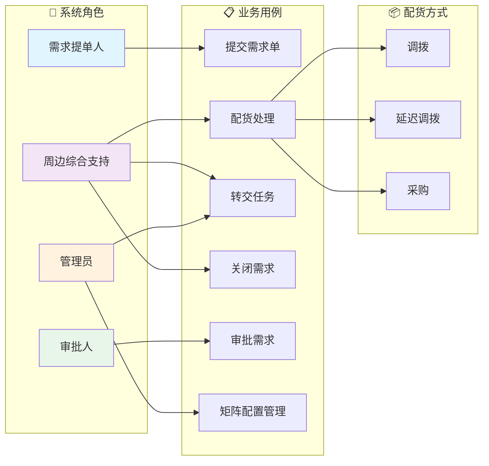

# 周边需求配货系统 - 业务用例图

## 用例详细说明

### 1. 需求提单人
| 用例 | 说明 |
|------|------|
| 提交需求单 | 创建周边需求单，填写需求明细（IP、单品、数量等） |

### 2. 周边综合支持
| 用例 | 说明 |
|------|------|
| 配货处理 | 对待配货需求进行配货，支持三种方式：调拨/延迟调拨/采购 |
| 转交任务 | 将待处理任务转交给其他同岗位人员 |
| 关闭需求 | 对无法完成配货的需求明细进行关闭 |

### 3. 审批人
| 用例 | 说明 |
|------|------|
| 审批需求 | 对需求明细进行审批通过/驳回 |

### 4. 管理员
| 用例 | 说明 |
|------|------|
| 转交任务 | 可针对全部待配货数据进行转交 |
| 矩阵配置管理 | 配置IP与周边综合支持的分配矩阵 |

---

## 配货方式详解

| 配货方式 | 触发条件 | 正向流程 | 逆向流程 |
|---------|---------|---------|---------|
| **调拨** | 公司有库存 | 自动发起调拨单，审批通过后生效 | 审批驳回后作废调拨单 |
| **延迟调拨** | 单品还在采购中 | 状态更新为"延迟调拨"，后续可改为调拨/采购 | 审批回退后改为"配货退回" |
| **采购** | 公司无库存、无在途采购 | 生成TODO，后续下采购申请单 | 审批回退后改为"配货退回" |
