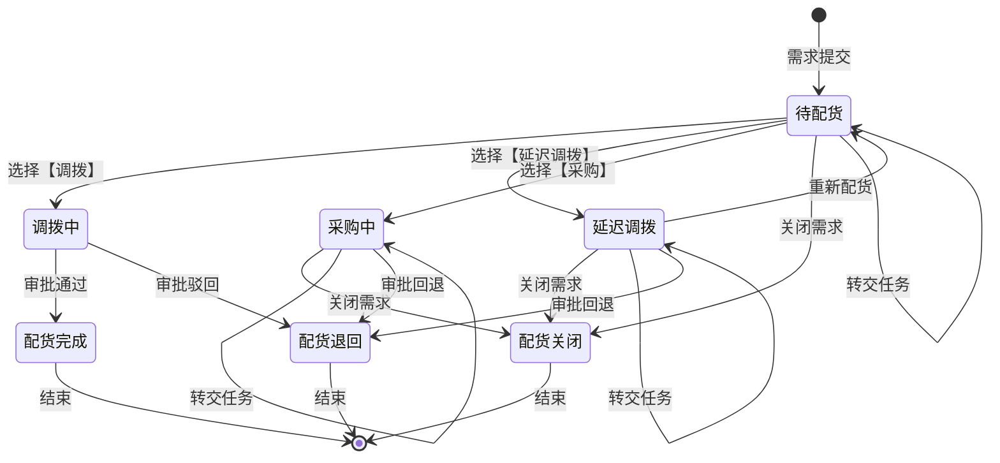

# 周边需求配货系统 - 配货状态机图



---

## 状态说明

| 状态 | 说明 | 触发条件 |
|-----|------|---------|
| **待配货** | 初始状态，等待周边综合支持处理 | 需求提交后自动分配 |
| **调拨中** | 已选择调拨方式，等待审批 | 选择【调拨】后 |
| **延迟调拨** | 暂时无法调拨，等待后续处理 | 选择【延迟调拨】后 |
| **采购中** | 已选择采购方式，等待采购流程 | 选择【采购】后 |
| **配货完成** | 调拨审批通过，进入出入库流程 | 审批通过 |
| **配货退回** | 审批被驳回或回退 | 审批驳回/回退 |
| **配货关闭** | 需求被手动关闭 | 手动关闭 |

---

## 状态转换规则

### 1. 待配货状态
```
可转换状态:
├── 调拨中      (动作: 选择【调拨】)
├── 延迟调拨    (动作: 选择【延迟调拨】)
├── 采购中      (动作: 选择【采购】)
├── 配货关闭    (动作: 关闭需求)
└── 待配货      (动作: 转交任务 - 变更处理人)
```

### 2. 调拨中状态
```
可转换状态:
├── 配货完成    (动作: 审批通过)
│   └── 结果: 调拨单生效，进入出入库流程
└── 配货退回    (动作: 审批驳回)
    └── 结果: 作废调拨单
```

### 3. 延迟调拨状态
```
可转换状态:
├── 待配货      (动作: 重新配货)
│   └── 场景: 采购完成且有多余库存时
│   └── 可改为: 调拨 或 采购
├── 配货关闭    (动作: 关闭需求)
│   └── 场景: 确认无法补货
├── 延迟调拨    (动作: 转交任务 - 变更处理人)
└── 配货退回    (动作: 审批回退)
```

### 4. 采购中状态
```
可转换状态:
├── 配货关闭    (动作: 关闭需求)
│   └── 场景: 采购数量不足，剩余无法满足
├── 采购中      (动作: 转交任务 - 变更处理人)
└── 配货退回    (动作: 审批回退)
```

### 5. 终态状态（不可再转换）
```
配货完成 ──→ 结束
配货退回 ──→ 结束
配货关闭 ──→ 结束
```

---

## 状态转换矩阵

| 当前状态 | 调拨 | 延迟调拨 | 采购 | 审批通过 | 审批驳回 | 审批回退 | 重新配货 | 关闭 | 转交 |
|---------|------|---------|------|---------|---------|---------|---------|------|------|
| 待配货 | 调拨中 | 延迟调拨 | 采购中 | - | - | - | - | 配货关闭 | 待配货 |
| 调拨中 | - | - | - | 配货完成 | 配货退回 | - | - | - | - |
| 延迟调拨 | - | - | - | - | - | 配货退回 | 待配货 | 配货关闭 | 延迟调拨 |
| 采购中 | - | - | - | - | - | 配货退回 | - | 配货关闭 | 采购中 |
| 配货完成 | - | - | - | - | - | - | - | - | - |
| 配货退回 | - | - | - | - | - | - | - | - | - |
| 配货关闭 | - | - | - | - | - | - | - | - | - |

---

## 转交规则详解

### 可转交的状态
| 状态 | 转交人 | 转交范围 |
|-----|-------|---------|
| 待配货 | 周边综合支持/管理员 | 同岗位其他人员 |
| 延迟调拨 | 周边综合支持/管理员 | 同岗位其他人员 |
| 采购中 | 周边综合支持/管理员 | 同岗位其他人员 |

### 转交场景
1. **个人原因**: 当前处理人暂时无法履行工作
2. **人员离职**: 管理员统一转交离职人员的全部待处理任务
3. **工作负载均衡**: 管理员根据工作量进行任务调整

---

## 关闭规则详解

### 可关闭的状态
| 状态 | 关闭场景 | 示例 |
|-----|---------|------|
| 待配货 | 单品无法完成配货/不合规 | 单品已停产、单品信息错误 |
| 延迟调拨 | 确认无法补货 | 供应商停止生产该单品 |
| 采购中 | 采购数量不足 | 申请100个，实际入库98个，剩余2个关闭 |

### 关闭后处理
- 状态变更为: **配货关闭**
- 该需求明细不再参与后续配货流程
- 已生成的调拨单/采购单需要手动处理
